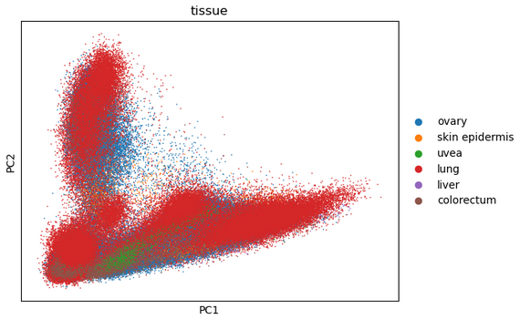
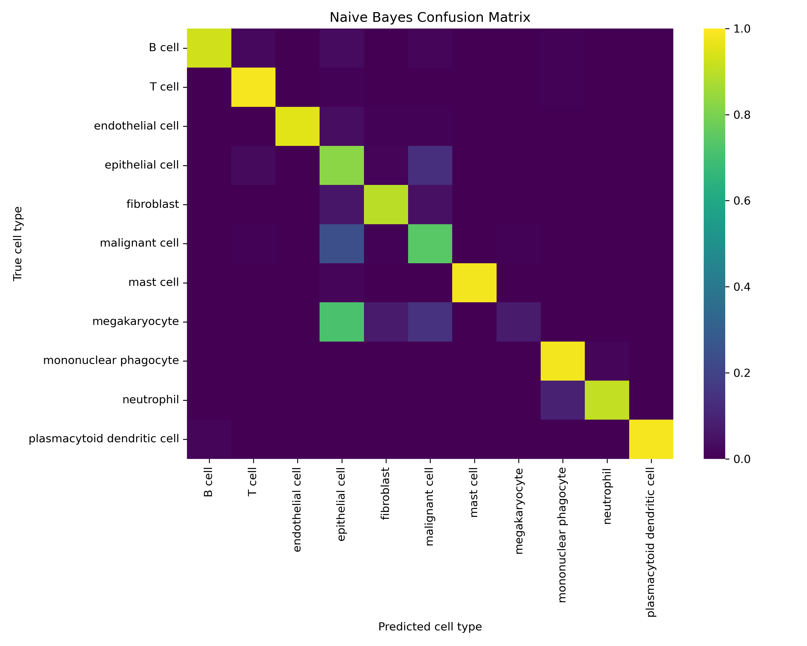
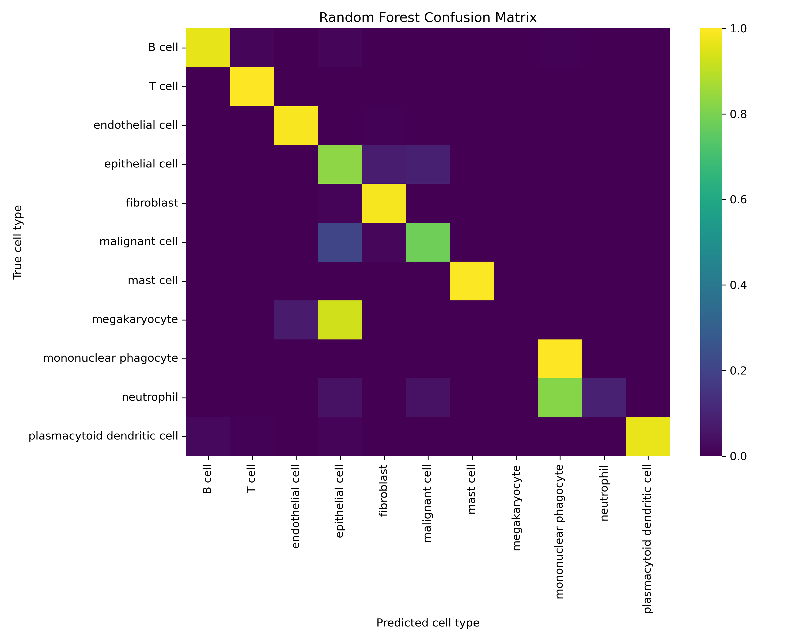
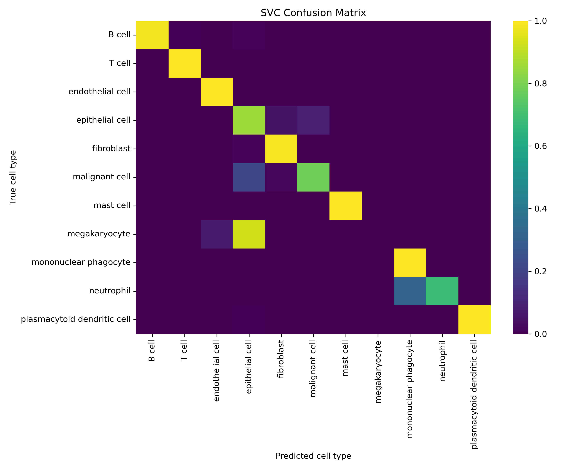
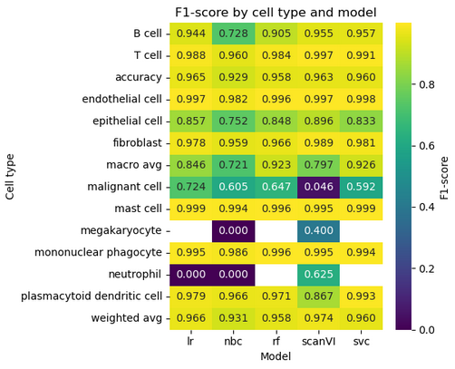
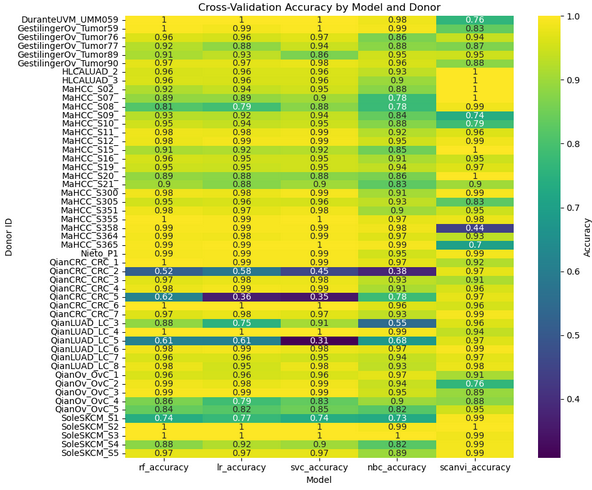
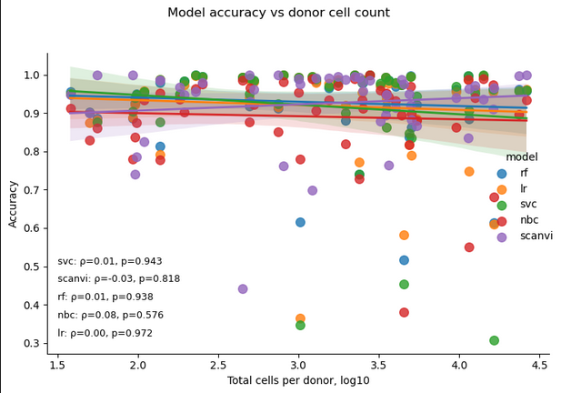
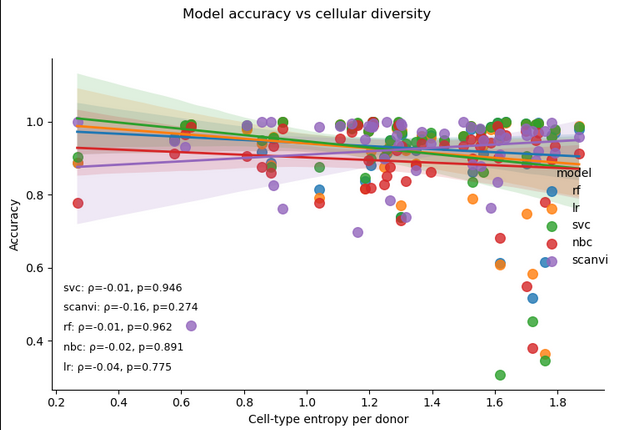

### Introduction

This side project explores the application of machine learning techniques to large-scale single-cell RNA sequencing data. The dataset was sourced from the Chan-Zuckerberg Initiative’s CellXGene database, specifically from the collection "Dissecting novel myeloid-derived cell states through single-cell RNA-Seq and its impact on clinical outcome across tumor types" (Guimarães et al.,  2024).

This integrated atlas compiles data from 13 single-cell studies across eight tumor types and normal tissues: breast, colorectal, ovary, lung, liver, skin, uvea, and peripheral blood. Four types of samples are represented in this resource: normal tissue, tumor, lymph node, and blood. Data were generated using three single-cell technologies including: 10x Genomics, Smart-seq2, and inDrop. The collection contains approximately 400,000 cells from 51 donors, and is provided as a preprocessed Scanpy object with detailed cell type annotations.

The objective of this analysis was to evaluate the accuracy of annotated cell type labels using both classical machine learning algorithms and scanVI. Portions of the code for this analysis were generated with the assistance of AI coding tools, and as such, the code has not been made public in this repository. Instead, the focus is on clearly documenting the methodology, results, and interpretation.

### Methods

This analysis began with classical machine learning techniques and progressed to the application of scanVI. Four classification models were evaluated: Naive Bayes Classifier, Support Vector Classifier , Random Forest, and logistic regression. Data processing and analysis relied on several established Python packages, specifically scanpy v1.11.1, pandas v2.3.3, numpy v2.3.5, matplotlib v3.10.8, seaborn v0.13.2, scikit-learn v1.5.2, scvi-tools v1.4.1, and joblib v1.5.2.

The workflow began by loading the single-cell dataset as an AnnData object using scanpy. To ensure consistency in assay chemistry, only cells generated using 10x 3' v2 and 10x 3' v3 technologies were retained. Counts were normalized to a target sum of 1000 per cell, followed by a log1p transformation. The top 3,000 highly variable genes were selected to reduce dimensionality and highlight informative features. Next, data were scaled with a maximum value threshold of 10, and principal component analysis was applied to obtain 50 components. After quality filtering, 215,834 cells remained for downstream analysis.

For model evaluation, the data were split into training and test sets at an 80:20 ratio. Cross-validation was implemented using a leave-one-donor-out approach to rigorously assess model performance across biological replicates. The scanVI analysis was performed using a similar strategy, and omitted the PCA step prior to modeling. Cross-validation for scanVI also employed the leave-one-donor-out method to maintain consistency in evaluation.

### Results

To assess potential sources of technical variation, an UMAP plot was generated to visualize overall data structure and batch effects (Figure 1). The plot revealed minimal batch-related separation among samples, indicating that batch effects were largely controlled in the preprocessed dataset. PCA was then performed to further explore data composition with respect to assay type, cell type, and tissue of origin (Figures 2–4). Visualization by assay (Figure 2) showed that the majority of cells were generated using the 10x 3' v2 chemistry. PCA colored by cell type (Figure 3) highlighted diversity across the major annotated populations. Tissue origin analysis (Figure 4) revealed that most cells in the dataset originated from lung samples.

A breakdown of major cell types present in the dataset is shown in Table 1. T cells represented the largest population, followed by fibroblasts, mononuclear phagocytes, epithelial cells, endothelial cells, and malignant cells. Smaller populations of B cells, mast cells, plasmacytoid dendritic cells, neutrophils, and megakaryocytes were also detected.

### Table 1, counts of cell types in the dataset

| cell type                   | count |
|-----------------------------|-------|
| T cell                      | 54626 |
| fibroblast                  | 40996 |
| mononuclear phagocyte       | 35382 |
| epithelial cell             | 26483 |
| endothelial cell            | 25883 |
| malignant cell              | 21011 |
| B cell                      | 7683  |
| mast cell                   | 3033  |
| plasmacytoid dendritic cell | 598   |
| neutrophil                  | 117   |
| megakaryocyte               | 22    |

### Figure 1

UMAP projection used to assess the presence of batch effects.

### Figure 2

Principal component analysis colored by assay type.

### Figure 3

Principal component analysis colored by cell type.

### Figure 4

Principal component analysis colored by tissue of origin. 

The distribution of cells by tissue type is summarized in Table 2. Most cells in the dataset originated from lung samples (n=109,074), followed by ovary (n=66,317), colorectum (n=18,837), skin epidermis (n=13,709), liver (n=6,661), and uvea (n=1,236). Consistent with the overall cell type breakdown, T cells were the predominant population across these tissues.

### Table 2,  Distribution of cells by tissue type

| tissue         | count  |
|----------------|--------|
| lung           | 109074 |
| ovary          | 66317  |
| colorectum     | 18837  |
| skin epidermis | 13709  |
| liver          | 6661   |
| uvea           | 1236   |

To evaluate the performance of cell type classification, mean accuracies from leave-one-donor-out cross-validation were calculated for each model, as shown in Table 3. The random forest model achieved the highest average accuracy (0.93), closely followed by scanVI (0.92), logistic regression (0.92), and support vector classification (0.92). The naive Bayes classifier had the lowest mean accuracy (0.89).

### Table 3, Leave-one-donor-out mean accuracy for each classification model

| model | lodo mean accuracy |
|-------|--------------------|
| rf    | 0.9278676966071018 |
| lr    | 0.9190577562437937 |
| svc   | 0.9185138149005776 |
| nbc   | 0.8905101594967151 |
| scanvi | 0.924              |

Confusion matrices for each model (Figures 5–9) illustrate how well cell types were distinguished. While most cell types were classified accurately, all models struggled with certain cell populations, particularly megakaryocytes. Lower representation of megakaryocytes and neutrophils in the dataset led to reduced classification performance for these cell types, as shown by lower F1 scores (Figure 10). Additionally, classification between malignant cells and epithelial cells showed reduced accuracy, likely due to an abundance of lung tissue samples in which epithelial cells are common, which can cause overlap with malignant cell transcriptomic profiles.

### Figure 5

Confusion matrix for NBC. 

### Figure 6

Confusion matrix for logistic regression. 

### Figure 7

Confusion matrix for random forest. 

### Figure 8

Confusion matrix for SVC.

### Figure 9

Confusion matrix for ScanVI. 

F1 score analysis by cell type and model (Figure 10) further revealed low scores for megakaryocytes and neutrophils in all models. Similarly, distinctions between malignant and epithelial cells were challenging.

### Figure 10

The accuracy of cell type classification models was further examined across individual donors using leave-one-donor-out cross-validation (Figure 11). Classical machine learning models displayed reduced accuracy for several donors, specifically QianCRC_CRC_2 (colorectal), QianCRC_CRC_5 (colorectal), QianLUAD_LC_3 (lung), QianLUAD_LC_5 (lung), and QianOV_OvC_5 (ovary). In contrast, scanVI achieved high accuracy with these same donors. Conversely, scanVI showed decreased accuracy for donors MaHCC_S09_ (liver), MaHCC_S10_ (liver), MaHCC_S305 (liver), MaHCC_S358 (liver), and MaHCC_S365 (liver), while classical models maintained relatively high performance for these samples.

### Figure 11

Finally, I investigated whether assay version or sample-specific mitochondrial content contributed to model performance differences across donors. First, I compared assay type for each donor that showed discrepant performance between classical models and scanVI. All donors in this subset utilized the 10x 3' v2 chemistry, which suggested that assay platform is not a likely source of variation.

Next, I evaluated the average mitochondrial percentage for each donor (Table 4) to assess cellular quality. All samples exhibited mean mitochondrial percentages within an expected range, and there were no clear trends associating mitochondrial content with classification accuracy. 

### Table 4, Mean mitochondrial percentage per donor for samples with notable model performance differences

| Donor         | Mitochondrial percentage |
|---------------|--------------------------|
| QianCRC_CRC_2 | 4.771214745989111        |
| QianCRC_CRC_5 | 6.738703319704084        |
| QianLUAD_LC_3 | 4.561149921746159        |
| QianLUAD_LC_5 | 4.360689761121538        |
| QianOv_OvC_5  | 4.568049856152212        |
| MaHCC_S09_    | 2.426760888551096        |
| MaHCC_S10_    | 4.865892493263635        |
| MaHCC_S305    | 2.517640051403506        |
| MaHCC_S358    | 2.8232531401507353       |
| MaHCC_S365    | 2.1874718989487985       |

Reviewing the cell type compositions of these donor samples initially suggested that classical models performed worst on donors with thousands of cells spanning multiple cell types, whereas scanVI encountered difficulties primarily in donors with lower total cell counts, often limited to tens or hundreds of cells per sample. However, to directly evaluate whether donor cell count or cellular diversity explained the observed differences in accuracy, model performance was plotted against both metrics across all donors. As shown in Figures 12 and 13, there was little to no correlation between model accuracy and either donor cell count or cellular diversity, as determined by Spearman correlation (all rho values near zero, p > 0.2 for all models). This analysis indicates that, despite the initial observation, discrepancies in model performance between classical machine learning and scanVI cannot be fully explained by simple differences in sample size, number of cell types, or other basic sample characteristics.

### Figure 12

Rho and p-values calculated with spearman correlation. There is little to no correlation between model accuracy and donor cell count. 

### Figure 13

Rho and p-values caclulated with spearman correlation. There is little to no correlation between model accuracy and cellular diversity. 

### Future directions

The variation in model performance across donors, where classical models showed lower accuracy for some donors and scanVI for others, suggests that combining complementary approaches may help improve overall classification accuracy. Future work could involve the development of ensemble strategies that leverage the strengths of each method. Additionally, further analyses can be performed by subsetting the dataset to increase representation of rare cell types such as neutrophils and megakaryocytes, or by evaluating model performance on subsets less dominated by lung derived cells.

While these steps may increase performance, the precise factors underlying reduced accuracy in certain donors for both classical models and scanVI remain unclear. Expanded exploration of donor specific features or alternative normalization methods may help explain the discrepancy in performance between certain donors. 

### References

Guimarães, G.R., Maklouf, G.R., Teixeira, C.E. et al. Single-cell resolution characterization of myeloid-derived cell states with implication in cancer outcome. Nat Commun 15, 5694 (2024). https://doi.org/10.1038/s41467-024-49916-4

