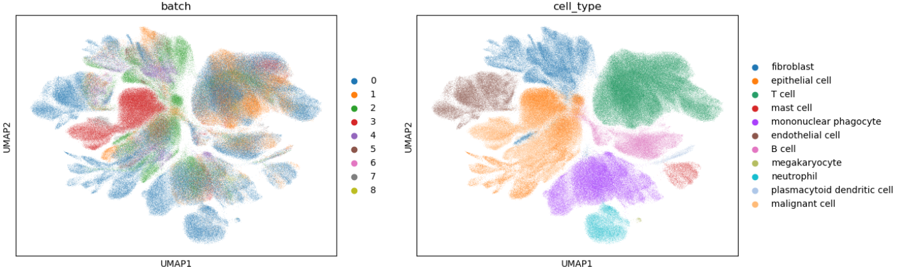
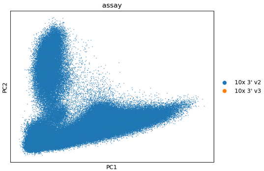
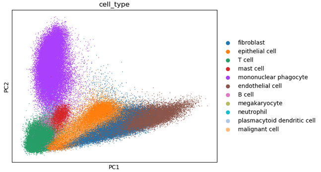
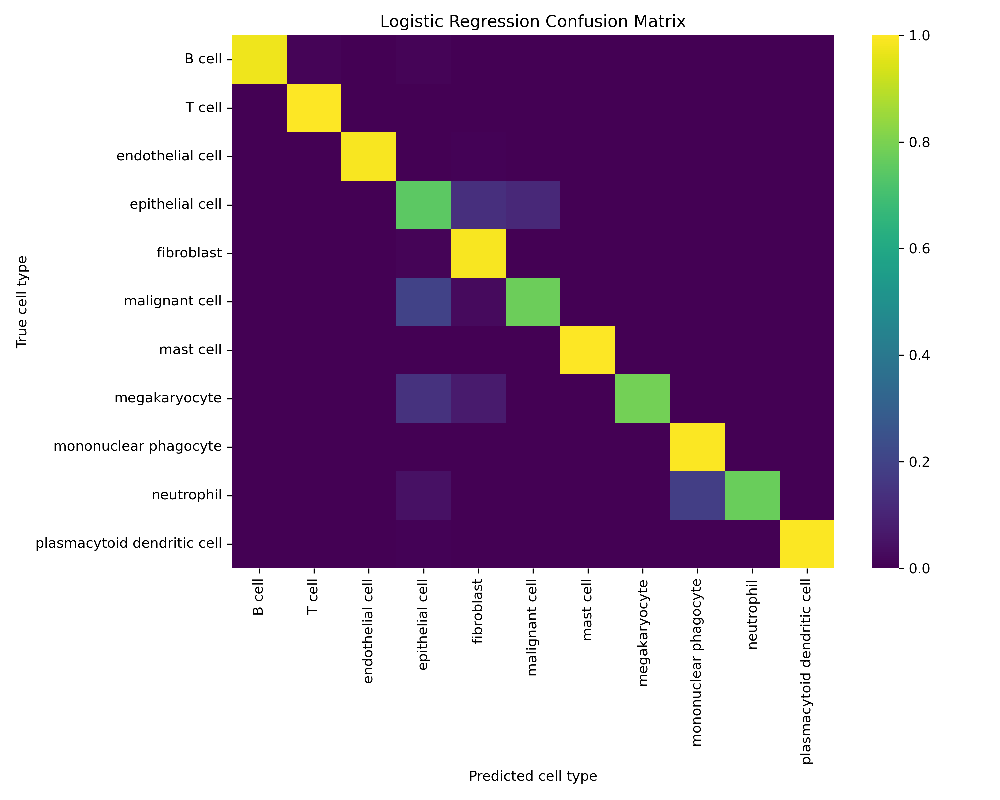
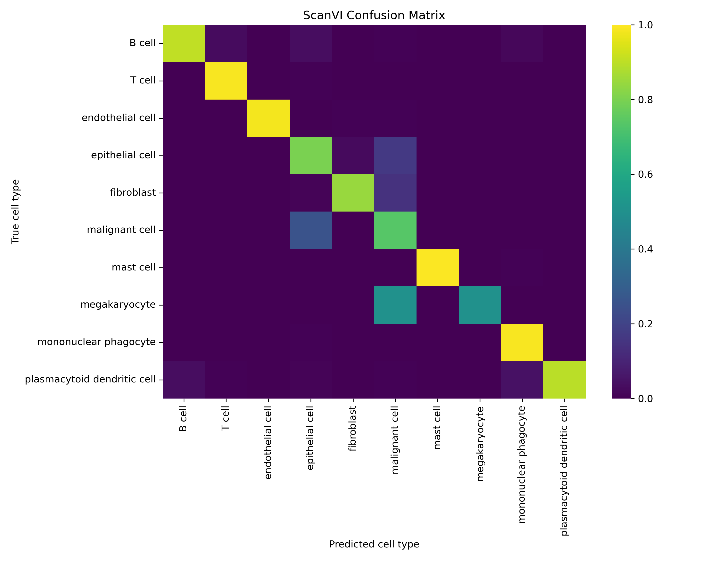

# Single-cell-machine-learning

Work in progress ... check back later

### Figure 1

UMAP to assess for batch effects. 

### Figure 2

PCA to understand how assay type might imbalance the data. 

### Figure 3

PCA to understand how cell type might imbalance the data. 

### Figure 4

PCA to understand how tissue type might imbalance the data. 

### Figure 5

Confusion matrix for NBC. 

### Figure 6

Confusion matrix for logistic regression. 

### Figure 7

Confusion matrix for random forest. 

### Figure 8

Confusion matrix for SVC.

### Figure 9

Confusion matrix for ScanVI. 
